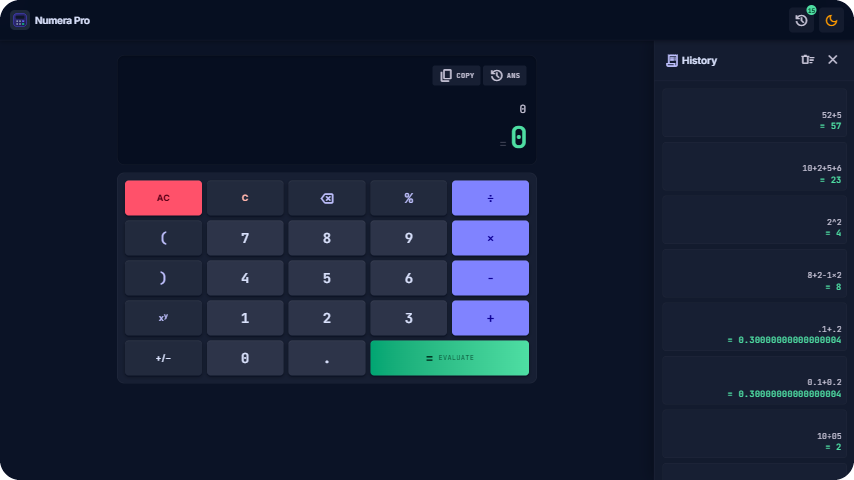
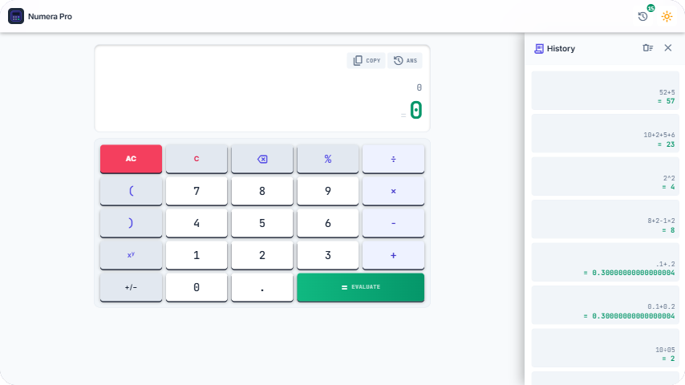
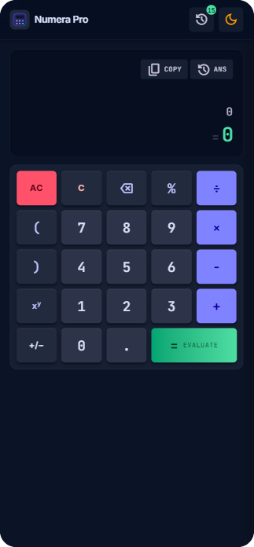
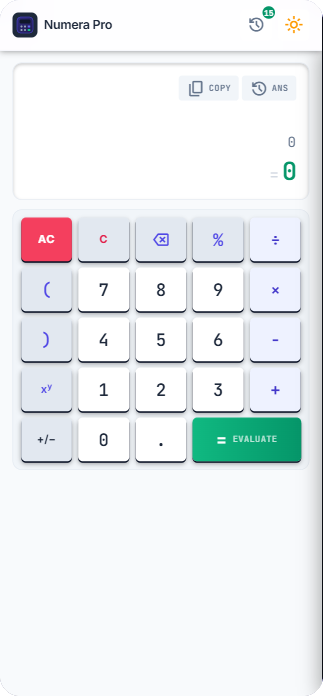

# Numera Pro

A modern, keyboard-friendly calculator built with React, TypeScript, and Tailwind CSS. It features a dark/light theme, evaluate-on-equals behavior, and a persistent history ledger.

## Screenshots

<!--
  Place the screenshots at these paths:
  - docs/screenshots/dark-desktop.png
  - docs/screenshots/light-desktop.png
  - docs/screenshots/dark-mobile.png
  - docs/screenshots/light-mobile.png
-->

| Dark (desktop) | Light (desktop) |
| --- | --- |
|  |  |

| Dark (mobile) | Light (mobile) |
| --- | --- |
|  |  |

## Features

- **Evaluate on demand** — the answer is shown only when you press `=` (or `Enter`); typing edits the live formula without touching the result.
- **Standard calculator behaviors** — operator chaining, replacement, and ignore rules; `NEG` (toggle sign), `%`, and `^` (power) support; `()` grouping.
- **Precise entry rules** — up to 12 entry digits, leading-zero handling, single decimal point.
- **Error handling** — division by zero and malformed expressions show an inline error and auto-reset the display.
- **History ledger** — results are persisted to `localStorage` (capped at 50 entries); tap an entry to restore it into the calculator.
- **Dark / light themes** — toggle from the header; your choice is persisted and defaults to dark.
- **Responsive layout** — the history panel is a side drawer on desktop and a full-width, tap-outside-to-dismiss overlay on mobile.
- **Keyboard shortcuts** — full keyboard input.

### Keyboard shortcuts

| Key | Action |
| --- | --- |
| `0-9`, `.` | Enter digit / decimal point |
| `+ - * /` | Operator (`*` → `×`, `/` → `÷`) |
| `(` `)` | Parentheses |
| `%`, `^` | Percent / power |
| `Enter` | Evaluate (`=`) |
| `Backspace` | Delete last character |
| `Escape` | Reset the calculator |

## Getting started

Requires **Node.js ≥ 20**.

```sh
npm install
npm run dev
```

Open the URL printed by Vite (default `http://localhost:5173`).

### Scripts

| Script | Description |
| --- | --- |
| `npm run dev` | Start the Vite dev server |
| `npm run build` | Type-check and build for production (`dist/`) |
| `npm run preview` | Preview the production build locally |
| `npm run lint` | ESLint over the project |

## Tech stack

- **React 19** with TypeScript (strict)
- **Vite 8** as the build tool
- **Tailwind CSS v4** — theming through CSS `@theme` tokens in `src/index.css`; the light palette is layered as `html.light` variable overrides, so switching themes requires no component changes

## Project structure

```
calculator-app/
├── docs/screenshots/     # README screenshots
├── scripts/              # (optional) repo automation
├── src/
│   ├── lib/              # pure logic: evaluate, entry rules, formatting
│   ├── hooks/            # useCalculator, useTheme
│   ├── components/       # Calculator, Display, Keypad, Header, HistoryPanel, Icon
│   ├── App.tsx
│   └── index.css         # Tailwind v4 @theme tokens + light-mode overrides
├── index.html
└── tsconfig.*.json
```

## Theming & persistence

- Theme preference is stored under `numera-pro:theme` (`dark` or `light`); the app defaults to dark.
- Calculator history is stored under `numera-pro:history` as an array of `{ expr, res }` objects, capped at the most recent 50 entries.